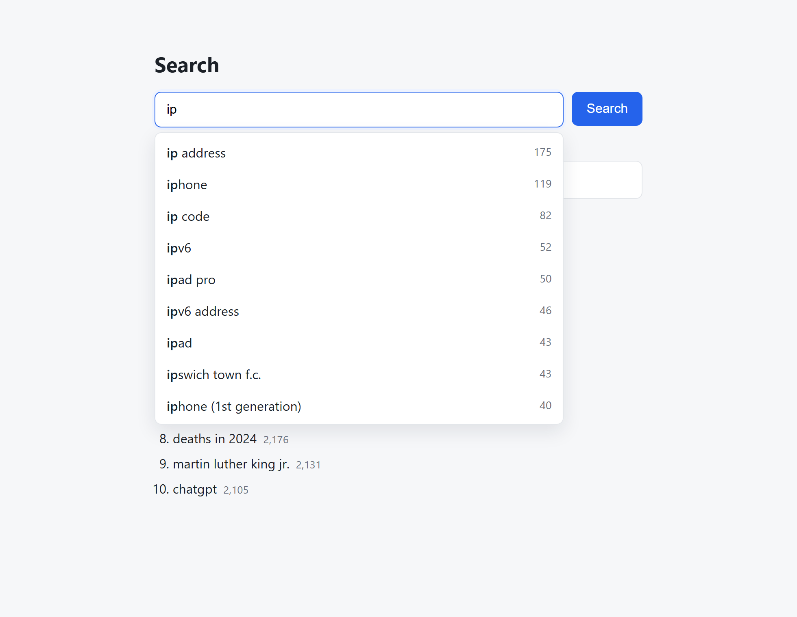
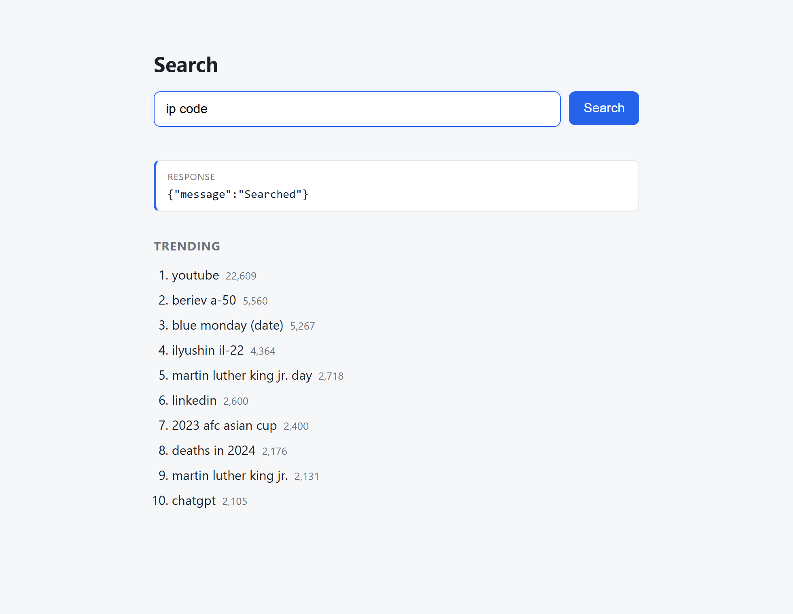

# Search Typeahead

A search autocomplete system: type a prefix, get the 10 most popular matching queries; submit a
search and the popularity updates. The interesting part is the backend - a prefix trie for fast
reads, a distributed cache addressed by consistent hashing, recency-aware "trending" ranking, and
batched writes so the database isn't hit on every search.

Built for the HLD assignment (24BCS10064). The design write-up is in [REQUIREMENTS.md](REQUIREMENTS.md);
this file is just how to run it.

## Stack

- **Node.js + Express** backend
- **SQLite** as the primary store, via Node's built-in `node:sqlite` - **no native modules to compile**
- **3 real Redis nodes** (Docker Compose) on a consistent-hash ring the app implements itself. An
  in-process `memory` backend is also built in for tests and offline runs (`CACHE_BACKEND=memory`),
  using the exact same ring.
- **Vanilla HTML/CSS/JS** frontend, no build step

Requires **Node 22+** (uses `node:sqlite`) and **Docker** (for the Redis nodes). Tested on Node 24.

## Quick start

```bash
npm install

# The full 150k-row dataset (data/queries.csv) ships with the repo, so just:
npm run load

docker compose up -d              # start the 3 Redis cache nodes (ports 6379-6381)
CACHE_BACKEND=redis npm start     # http://localhost:3000
```

No Docker handy? Run against the in-process cache instead - same routing, same API:

```bash
npm start                         # CACHE_BACKEND defaults to memory
```

Other data options:

```bash
npm run load:sample        # tiny bundled sample, if you just want it up fast
npm run fetch-data         # re-download a fresh Wikipedia pageviews dump
npm run load               # then load whatever is in data/queries.csv
```

Open http://localhost:3000, start typing.

## Screenshots

Prefix suggestions — the trie returns the top matches as you type, prefix bolded, ranked by count:



Keyboard navigation (↑/↓ to move, Enter to search) and the `POST /search` response:



The landing view and keyboard-highlight states are in [docs/screenshots/](docs/screenshots/).

## Dataset

The store expects `query,count` rows. Two ways to fill it:

1. **Bundled sample** - `data/sample-queries.csv` (~116 rows) is committed so the app works the
   moment you clone it. Good enough to see suggestions, trending and batching working; too small for
   meaningful latency/distribution numbers.
2. **Full dataset (>=100k, for the real demo)** - `npm run fetch-data` streams one hour of the
   [Wikipedia pageviews dump](https://dumps.wikimedia.org/other/pageviews/), keeps English titles,
   uses page title as the query and view count as popularity, and writes the top 150k to
   `data/queries.csv`. Then `npm run load`.

   ```bash
   node scripts/download-dataset.js 150000 20240115 12   # topN, YYYYMMDD, hour
   ```

   Why Wikipedia pageviews and not the AOL query log: same `query,count` shape, but fully open with
   no privacy baggage and a stable URL. Reasoning is in [REQUIREMENTS.md §9](REQUIREMENTS.md).

## Try the APIs

```bash
curl "http://localhost:3000/suggest?q=ip"
curl -X POST http://localhost:3000/search -H "Content-Type: application/json" -d '{"query":"ipl 2024"}'
curl "http://localhost:3000/trending"
curl "http://localhost:3000/cache/debug?prefix=ip"
curl "http://localhost:3000/stats"
```

Full API reference: [docs/api.md](docs/api.md).

## Tests and benchmark

```bash
npm test                 # unit tests for trie / ring / trending / cache
npm start &              # in one terminal
npm run bench 20000      # latency p95 + cache hit rate, in another
```

## Configuration

Everything has a default in [src/config.js](src/config.js); copy `.env.example` to `.env` to override.
The one worth flipping for the demo is the ranking mode:

```bash
RANK_MODE=popularity npm start   # 60% baseline: sort by all-time count
RANK_MODE=trending   npm start   # default: recency-aware ranking
```

The other one is the cache backend:

```bash
CACHE_BACKEND=redis  npm start   # real Redis nodes from docker-compose.yml
CACHE_BACKEND=memory npm start   # default: in-process nodes, no Docker
```

## Layout

```
src/
  server.js          Express app + routes
  suggestService.js  read path: cache -> trie -> recency re-rank
  trie.js            prefix trie, per-node top-K candidates
  consistentHash.js  hash ring with virtual nodes
  cache.js           distributed cache (redis or memory backend + TTL)
  trending.js        decayed recency scoring
  batchWriter.js     buffer -> aggregate -> periodic/size flush
  db.js              SQLite primary store (node:sqlite)
scripts/             download-dataset / load / bench
public/              UI
test/                unit tests
docs/                architecture, api, performance report
```

## Docs

- [REQUIREMENTS.md](REQUIREMENTS.md) - what's being built and why each decision was made
- [docs/architecture.md](docs/architecture.md) - components, data flow, diagram
- [docs/api.md](docs/api.md) - endpoint reference
- [docs/performance-report.md](docs/performance-report.md) - measured latency, cache hit rate, write reduction
